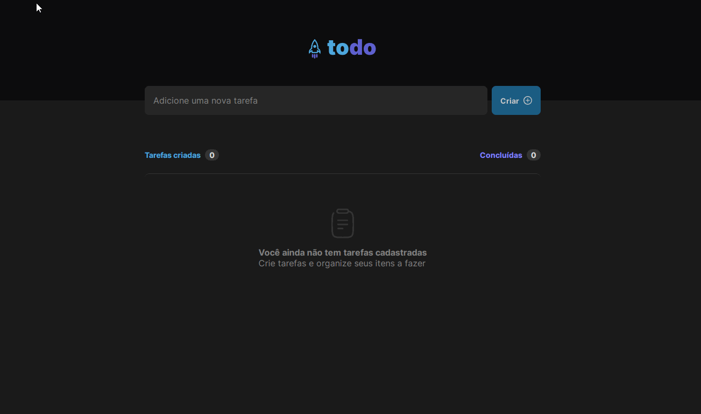

# To-Do List
> Projeto desenvolvido no *Desafio 01 - Praticando os conceitos do ReactJS* da trilha **Ignite 2022 - Rocketseat**.

 

O desafio foi proposto para reforçar os conceitos iniciais mais importantes do ReactJS, como **Estados, Imutabilidade, Propriedades e Componentização**. Consiste em uma lista de tarefas com as seguintes funcionalidades:

- [x] Adicionar uma nova tarefa
- [x] Marcar e desmarcar uma tarefa como concluída
- [x] Remover uma tarefa da listagem
- [x] Mostrar o progresso de conclusão das tarefas

### Features extras
- [x] Adicionar e remover tarefas do Local Storage
- [x] Responsividade
## Tecnologias e ferramentas utilizadas
- ReactJS (Vite)
- CSS Modules
- TypeScript
- uuid

Para acessar o projeto em produção [Clique aqui!](https://todo-list-lailsonlm.vercel.app/)